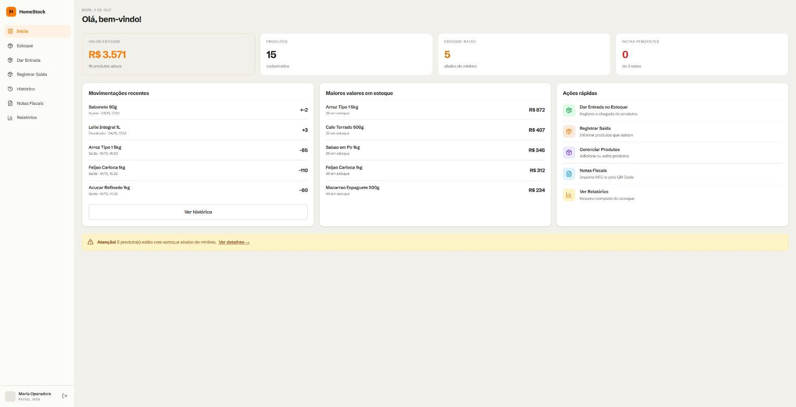
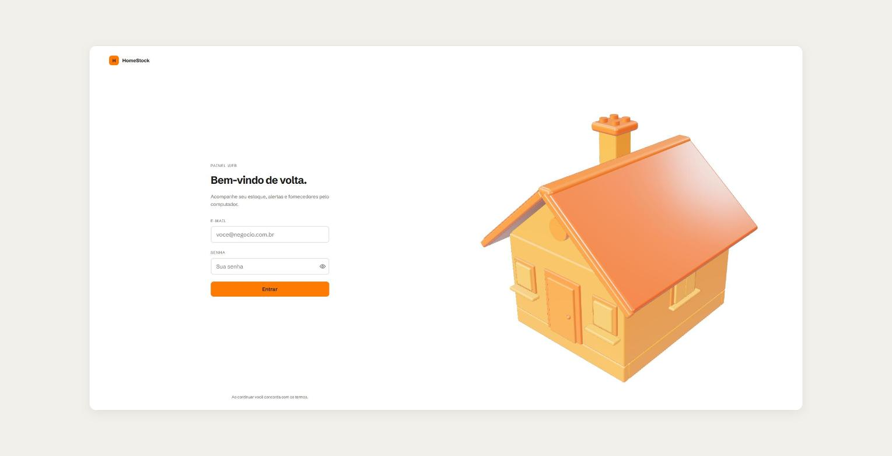
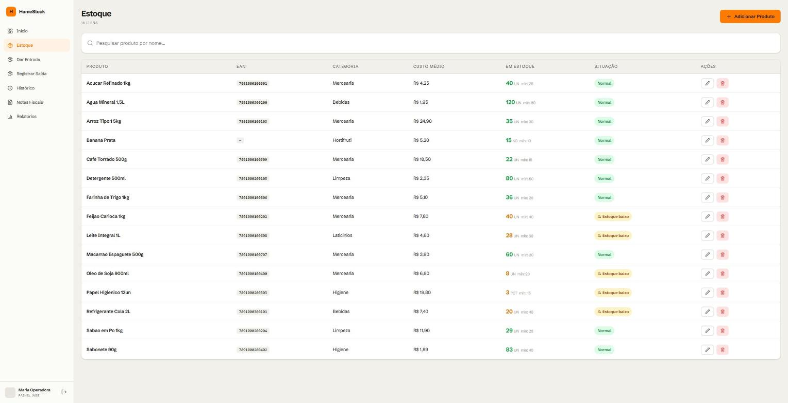
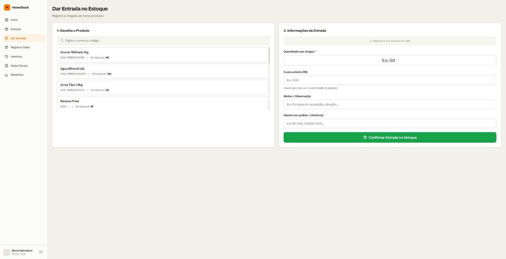
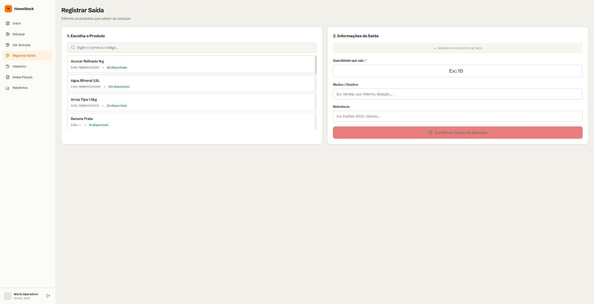
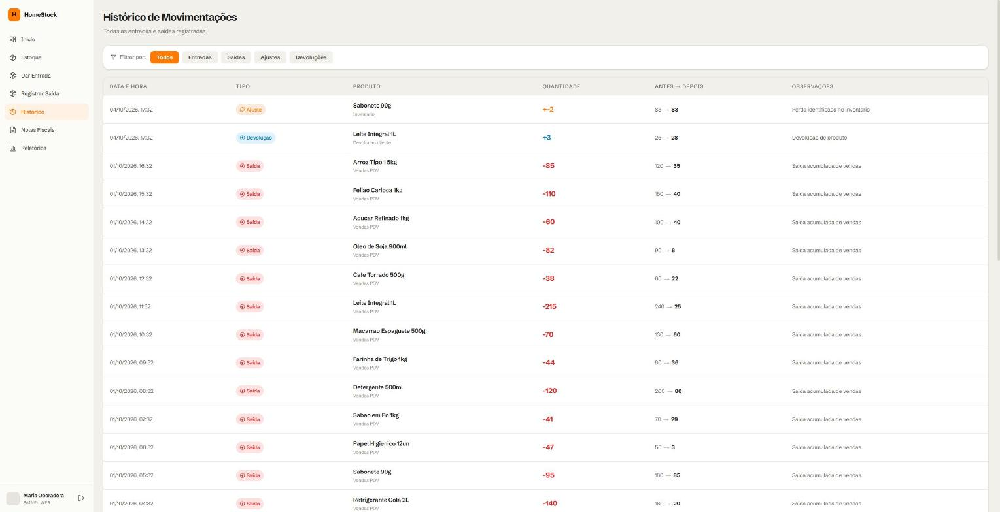
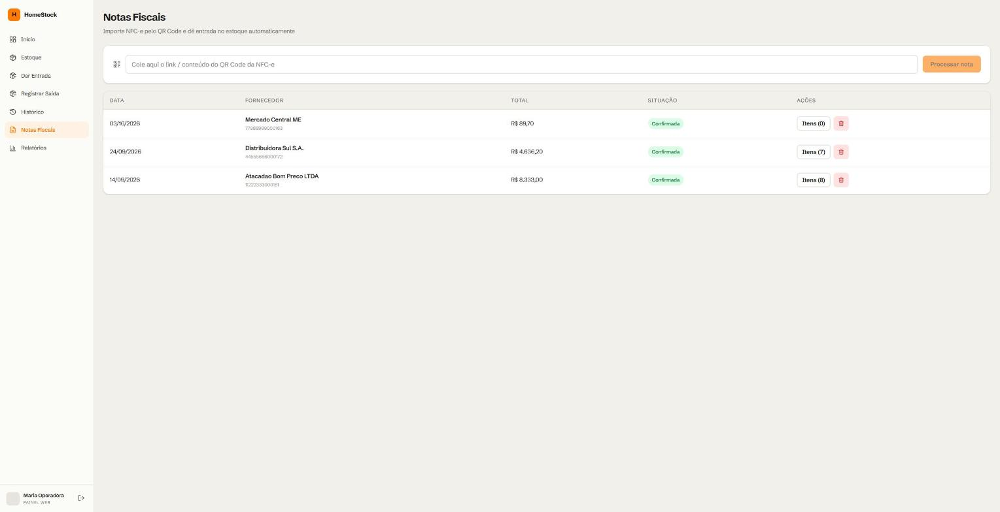
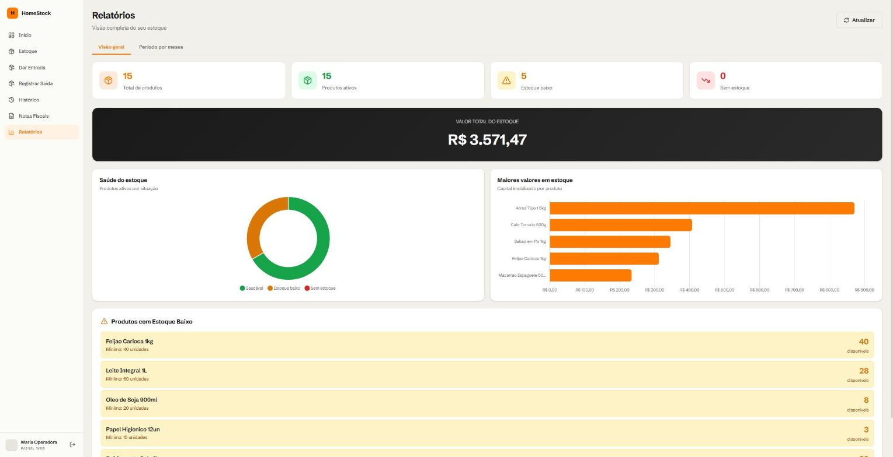
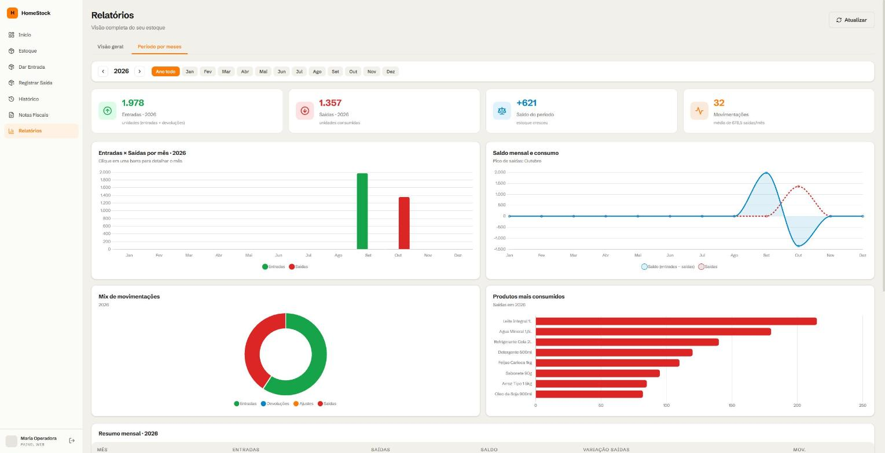

# HomeStock — Frontend

Painel web para controle de estoque: cadastro de produtos, entradas e saídas, histórico de movimentações, importação de notas fiscais (NFC-e) e relatórios com gráficos.



## Funcionalidades

- **Autenticação** com JWT e renovação automática do token (refresh token). Rotas protegidas.
- **Dashboard** com valor total do estoque, alertas de estoque baixo, movimentações recentes e ações rápidas.
- **Estoque** — listagem, busca, criação, edição e desativação de produtos, com situação (Normal / Estoque baixo).
- **Entrada e saída** de produtos com custo unitário, motivo e referência.
- **Histórico** de todas as movimentações (entrada, saída, ajuste, devolução) com filtro por tipo.
- **Notas fiscais** — importa NFC-e pelo QR Code e dá entrada automática no estoque.
- **Relatórios** com gráficos (Chart.js), em duas abas: *Visão geral* e *Período por meses*.

## Telas

### Login


### Estoque


### Dar entrada / Registrar saída



### Histórico de movimentações


### Notas fiscais


### Relatórios — Visão geral
Indicadores, saúde do estoque (saudável / baixo / zerado), produtos de maior valor imobilizado e listas de alerta.



### Relatórios — Período por meses
Seleção de ano e mês, KPIs do período (entradas, saídas, saldo, movimentações e variação de saídas vs. mês anterior), gráfico de entradas × saídas, saldo mensal, mix de movimentações, ranking de produtos mais consumidos e tabela de resumo mensal. Clicar em uma barra do gráfico ou em uma linha da tabela detalha o mês.




## Tecnologias

- [React 18](https://react.dev) + [Vite](https://vitejs.dev)
- [React Router](https://reactrouter.com)
- [Axios](https://axios-http.com) (interceptors para JWT e refresh)
- [Chart.js](https://www.chartjs.org) + react-chartjs-2
- [Three.js](https://threejs.org) (casa 3D da tela de login)
- [lucide-react](https://lucide.dev) (ícones)

## Pré-requisitos

- Node.js 18+
- API backend rodando em `http://localhost:8080` (o Vite faz proxy de `/api` para ela)

## Como rodar

```bash
npm install
npm run dev
```

A aplicação sobe em http://localhost:3000.

Outros comandos:

```bash
npm run build     # gera a build de produção em dist/
npm run preview   # serve a build localmente
```

## Estrutura

```
src/
├── api/          # cliente Axios e endpoints (auth, produtos, movimentações, notas, dashboard)
├── components/   # Navbar, Toast, ConfirmModal, LoadingSpinner, House3D, ProtectedRoute
├── context/      # AuthContext (sessão do usuário)
├── pages/        # Login, Dashboard, Products, StockEntry, StockExit, History, Invoices, Reports
└── styles/       # global.css
```

## Rotas

| Rota          | Tela                       |
| ------------- | -------------------------- |
| `/login`      | Login                      |
| `/`           | Dashboard                  |
| `/produtos`   | Estoque                    |
| `/entrada`    | Dar entrada no estoque     |
| `/saida`      | Registrar saída            |
| `/historico`  | Histórico de movimentações |
| `/notas`      | Notas fiscais (NFC-e)      |
| `/relatorios` | Relatórios                 |

## API

Todas as chamadas usam o prefixo `/api/v1` e o token JWT no header `Authorization: Bearer <token>`. O token fica em `sessionStorage` e é renovado automaticamente em caso de `401`.

Endpoints consumidos: `/auth`, `/products`, `/stock-movements`, `/invoices`, `/nfce`, `/company` e `/dashboard`.
